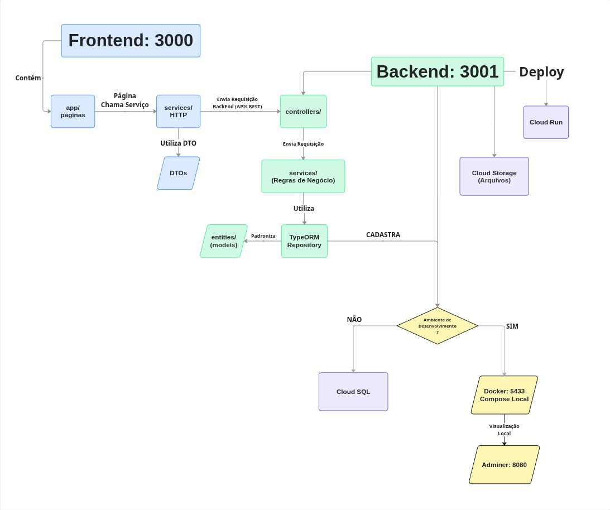

# Arquitetura do Projeto

## Visão Geral

O projeto é organizado como um **monorepo**: um único repositório Git contendo o frontend e o backend em pastas separadas. Essa escolha simplifica o desenvolvimento para times pequenos — não é necessário sincronizar dois repositórios diferentes para uma única mudança.

```
HealthTech/
├── backend/           → API (NestJS)
├── frontend/          → Interface web (Next.js)
├── docker-compose.yml → Banco de dados local
├── LICENSE
└── README.md
```

---

## Separação de Responsabilidades

O sistema é dividido em três camadas independentes que se comunicam de forma bidirecional. O diagrama abaixo mostra o fluxo completo de uma requisição, desde a interface do usuário até a persistência no banco de dados, incluindo a ramificação entre ambiente de desenvolvimento (Docker local) e produção (Google Cloud).



> **Figura 1** — Fluxo de dados e infraestrutura do projeto.

### Como ler o diagrama

| Cor        | Camada    | Responsabilidade                        |
| ---------- | --------- | --------------------------------------- |
| 🔵 Azul    | Frontend  | Interface, chamadas HTTP, tipagem (DTO) |
| 🟢 Verde   | Backend   | Controllers, regras de negócio, ORM     |
| 🟣 Roxo    | Produção  | Google Cloud (Cloud Run + Cloud SQL)    |
| 🟡 Amarelo | Dev local | Docker Compose + Adminer                |

---

## Fluxo de uma Requisição

```
Browser (Next.js)
  1. page.tsx chama o service HTTP correspondente
  2. service envia requisição REST ao backend
  3. Controller NestJS recebe e delega ao Service
  4. Service aplica regras de negócio e acessa o banco via TypeORM
  5. TypeORM persiste/consulta o PostgreSQL
  6. Resposta sobe pela mesma cadeia até o browser
```

### Ambiente de Desenvolvimento

- **Banco:** Docker Compose (PostgreSQL + Adminer em `localhost:8080`)
- **Backend:** `npm run start:dev` na porta `3001`
- **Frontend:** `npm run dev` na porta `3000`

### Ambiente de Produção

- **Backend:** Google Cloud Run (containerizado)
- **Banco:** Google Cloud SQL (PostgreSQL 16)
- **Arquivos:** Google Cloud Storage
- **Segredos:** Google Secret Manager

---

## DTOs e Entities

**DTOs (Data Transfer Objects):** Definem a forma dos dados que entram e saem da API. O `ValidationPipe` do NestJS valida automaticamente cada campo antes de chegar ao controller. O frontend também usa DTOs em TypeScript para garantir tipagem nas chamadas HTTP.

**Entities:** Representam as tabelas do banco de dados. O TypeORM usa as entities para criar/atualizar o schema (via `synchronize: true` em desenvolvimento) e para fazer queries sem SQL manual.

---

## Documentação por Camada

- [Frontend](frontend.md) — Estrutura de pastas, App Router, service pattern
- [Backend](backend.md) — Módulos NestJS, rotas, guards, fluxo de autenticação
- [Banco de Dados](banco-de-dados.md) — Entities, relacionamentos, schema
- [Infraestrutura](infra.md) — Cloud Run, GCS, Cloud SQL, Secret Manager
