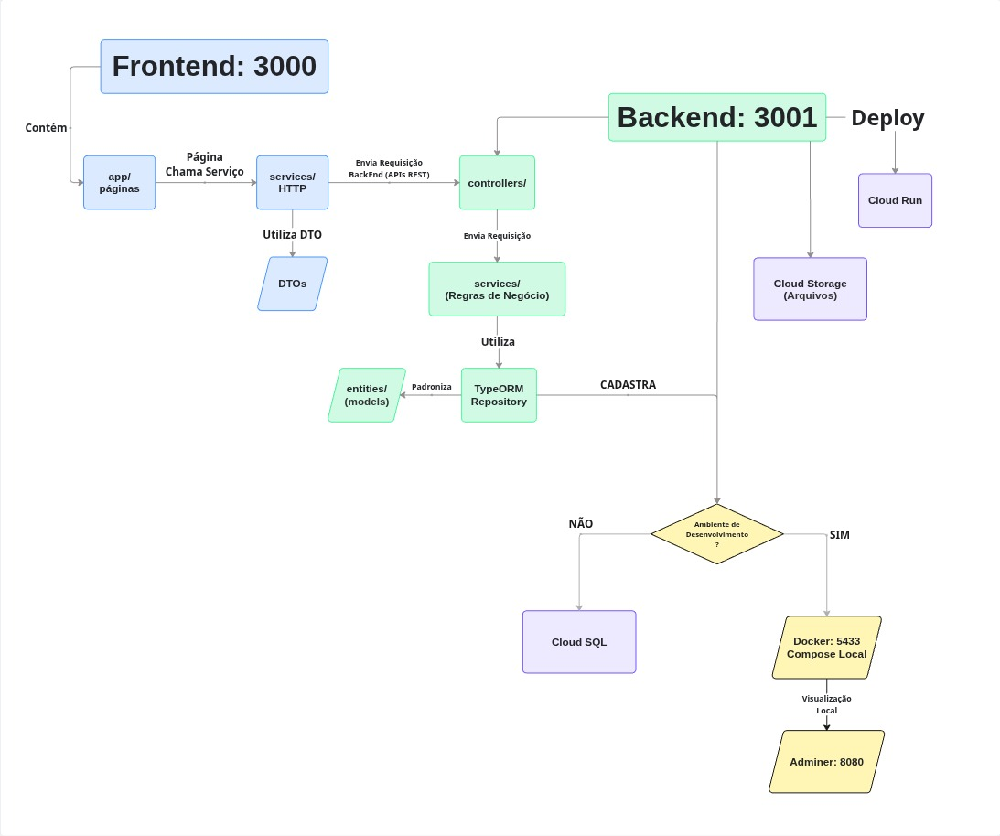

# Arquitetura do Projeto

## Visão Geral

O projeto é organizado como um **monorepo**: um único repositório Git contendo o frontend, o backend, o pipeline de CI/CD e a documentação em branch dedicada. A escolha simplifica o desenvolvimento para times pequenos, sem sincronizar dois repositórios diferentes para uma mesma mudança.

```
HealthTech/
├── backend/                → API (NestJS 11)
├── frontend/               → Interface web (Next.js 16)
├── db/init/                → Scripts SQL de inicialização
├── .github/                → Templates de issue/PR, Dependabot, CodeQL
├── .husky/                 → pre-commit (lint-staged)
├── docker-compose.yml      → banco + backend + frontend em containers
├── cloudbuild.yaml         → Pipeline CI/CD (Google Cloud Build)
├── LICENSE
└── README.md
```

---

## Separação de Responsabilidades

O sistema é dividido em camadas independentes que se comunicam pela rede. O diagrama abaixo mostra o fluxo completo de uma requisição, do navegador do usuário à persistência no banco, incluindo a ramificação entre ambiente de desenvolvimento (Docker Compose local) e produção (Google Cloud).



> **Figura 1**: fluxo de dados e infraestrutura do projeto.

### Como ler o diagrama

| Cor        | Camada    | Responsabilidade                              |
| ---------- | --------- | --------------------------------------------- |
| 🔵 Azul    | Frontend  | Interface, chamadas HTTP, tipagem (DTO)       |
| 🟢 Verde   | Backend   | Controllers, regras de negócio, ORM, auditoria|
| 🟣 Roxo    | Produção  | Google Cloud (Cloud Run, Cloud SQL, GCS)      |
| 🟡 Amarelo | Dev local | Docker Compose + Adminer                      |

---

## Fluxo de uma Requisição

```
Browser (Next.js)
  1. page.tsx pede ao hook (useFetchData ou hook de domínio)
  2. Hook chama o service correspondente
  3. Service faz fetch em /api/proxy/... (mesmo origin do frontend)
  4. Route handler do Next injeta cookie httpOnly como Authorization
  5. Backend NestJS recebe, passa por ValidationPipe, Guards e AuditInterceptor
  6. Controller delega ao Service; Service usa TypeORM Repository
  7. Persiste ou consulta o PostgreSQL
  8. Resposta sobe pela mesma cadeia até o browser
```

### Ambiente de Desenvolvimento

- **Banco**: Docker Compose (PostgreSQL 16 + Adminer em `localhost:8080`).
- **Backend**: container `backend` na porta `3001` (ou `npm run start:dev` sem Docker).
- **Frontend**: container `frontend` na porta `3000` (ou `npm run dev` sem Docker).

### Ambiente de Produção

- **Backend**: Cloud Run em `southamerica-east1`.
- **Frontend**: Cloud Run em `us-central1`.
- **Banco**: Cloud SQL (PostgreSQL 16).
- **Arquivos**: Cloud Storage.
- **Segredos**: Secret Manager.
- **Migrations**: Cloud Run Job dedicado (ver [ADR-0001](../desenvolvimento/adr/0001-migrations-via-cloud-run-job.md)).

---

## DTOs e Entities

**DTOs (Data Transfer Objects)**: definem a forma dos dados que entram e saem da API. O `ValidationPipe` global do NestJS valida cada campo antes de chegar ao controller (`whitelist: true`, `forbidNonWhitelisted: true`). O frontend usa DTOs equivalentes em TypeScript para tipar as respostas.

**Entities**: representam as tabelas do banco. O TypeORM usa as entities para consultas e para geração de migrations (comando `migration:generate`).

---

## Documentação por Camada

- [Frontend](frontend.md): estrutura de rotas, proxy `/api/proxy`, hooks, services, cookies httpOnly.
- [Backend](backend.md): módulos NestJS, catálogo de rotas, guards, auditoria, Swagger.
- [Banco de Dados](banco-de-dados.md): entidades, relacionamentos, migrations, workflow de vínculo.
- [Infraestrutura](infra.md): Cloud Run, Cloud Build, migrations job, Secret Manager, GCS.
