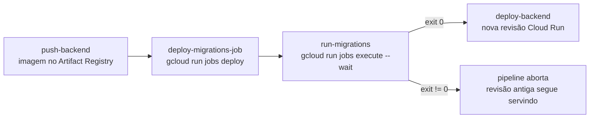

# ADR-0001: Executar migrations do TypeORM via Cloud Run Job independente no pre-deploy

- **Status:** Accepted
- **Data:** 2026-07-12
- **Autores:** @Diih
- **Deciders:** @Diih
- **Tags:** `infra` `deploy` `backend` `typeorm` `cloud-run`

## Contexto

O backend do HealthTech é um serviço NestJS que utiliza **TypeORM** para persistência em um **Cloud SQL (PostgreSQL)** e é publicado como um serviço **Cloud Run** (`healthtech-backend`) no pipeline definido em `cloudbuild.yaml`.

A cada deploy, é necessário aplicar as migrations pendentes antes que a nova revisão do backend passe a atender tráfego. Existem três formas comuns de fazer isso em ambientes serverless:

1. **Rodar `migration:run` no boot do container** (ex.: um `entrypoint.sh` que executa migrations antes de subir o Nest).
2. **Rodar migrations dentro do próprio pipeline de CI/CD** conectando diretamente ao banco a partir do Cloud Build.
3. **Deployar um Cloud Run Job dedicado** e executá-lo como um step do Cloud Build, antes do deploy do serviço de aplicação.

Restrições e características que pesaram na decisão:

- **Cloud Run escala a zero e reinicia contêineres frequentemente.** Uma falha no boot vira `crash loop`, e cada nova instância tentaria rodar migrations concorrentemente.
- **Migrations do TypeORM não são idempotentes por padrão** e não têm proteção transacional entre múltiplos runners simultâneos. Race conditions podem corromper o estado da tabela `migrations`.
- **O time é pequeno**, a operação precisa ser previsível e auditável sem exigir plantão.
- **O banco fica no Cloud SQL** com acesso via socket Unix (`INSTANCE_CONNECTION_NAME`). Conectar o Cloud Build direto ao banco exigiria expor IP público ou configurar Cloud SQL Auth Proxy no worker do Build, adicionando superfície de ataque e custo operacional.
- **O pipeline já constrói uma imagem única do backend**, reutilizável para o Job e para o Service, o que evita divergência de código entre "backend rodando" e "backend que roda migrations".

## Decisão

**Executamos as migrations em um Cloud Run Job separado (`healthtech-migrations`)**, deployado e executado como parte da Etapa 6 do `cloudbuild.yaml`, **antes** do deploy da nova revisão do serviço `healthtech-backend` (Etapa 7).

O Job:

- Usa a **mesma imagem** que o serviço de aplicação (`${_AR_REPO}/backend:$BUILD_ID`), garantindo paridade de código e de migrations.
- Sobrescreve `command`/`args` para executar `node node_modules/typeorm/cli.js migration:run -d dist/data-source.js`.
- Recebe os mesmos secrets e envs do serviço (`DB_USER`, `DB_PASSWORD`, `DB_NAME`, `INSTANCE_CONNECTION_NAME`) via Secret Manager e Cloud SQL connector.
- É executado com `--wait`, e **o pipeline só avança para o deploy do backend se a execução retornar sucesso**.

Referência no pipeline: `cloudbuild.yaml:150-184` (steps `deploy-migrations-job` e `run-migrations`).

## Alternativas consideradas

### Alternativa A: rodar migrations no boot do container do backend

- **Como funcionaria:** um `entrypoint.sh` executaria `typeorm migration:run` antes de iniciar o Nest.
- **Prós:** zero configuração de infra adicional; funciona no `docker-compose` local sem step extra.
- **Contras:**
  - **Crash loop:** se uma migration falhar, o container não sobe. Cloud Run vai reiniciar em loop, marcar a revisão como `unhealthy` e, dependendo da configuração de `min-instances`, pode derrubar **também a revisão atual** que já estava servindo, causando indisponibilidade total.
  - **Race condition:** com `min-instances > 1` ou durante warm-up, múltiplas instâncias podem executar migrations em paralelo. TypeORM lockeia a tabela `migrations`, mas o comportamento sob concorrência não é auditado nem garantido em produção.
  - **Startup lento:** aumenta o _cold start_, que é justamente uma métrica sensível no Cloud Run.
- **Por que foi descartada:** o custo de um outage por crash loop supera qualquer economia operacional.

### Alternativa B: rodar `migration:run` a partir do Cloud Build direto no banco

- **Como funcionaria:** um step do Cloud Build instalaria dependências e conectaria ao Cloud SQL via Auth Proxy ou IP público.
- **Prós:** não precisa de Job dedicado; menos objetos no Cloud Run.
- **Contras:**
  - Exige expor o banco ao Cloud Build (IP autorizado ou proxy), aumentando superfície de ataque.
  - O runner do Build usa **um ambiente diferente** do runtime de produção. Versões de Node, libs nativas de PG e SO podem divergir, causando migrations que "passam no CI e quebram em prod" ou vice-versa.
  - Sem imagem versionada, o ponto de execução das migrations não é reproduzível fora do pipeline.
- **Por que foi descartada:** perde paridade com o runtime real e piora o modelo de segurança.

### Alternativa C: Job manual (`gcloud run jobs execute` fora do pipeline)

- **Como funcionaria:** o desenvolvedor executa o Job manualmente após o deploy, quando julgar seguro.
- **Prós:** máximo controle humano.
- **Contras:** deploy deixa de ser automático, cria janela em que o código novo roda contra schema antigo, e depende de plantão.
- **Por que foi descartada:** incompatível com o objetivo de CI/CD contínuo do projeto.

## Consequências

### Positivas

- **Blast radius contido:** falha de migration aborta o pipeline **antes** de tocar na revisão em produção. O tráfego continua sendo servido pela revisão anterior (schema compatível) até o problema ser resolvido.
- **Sem crash loop:** o serviço de aplicação nunca é responsável por aplicar schema; ele apenas assume que o schema está pronto.
- **Execução única e serializada:** exatamente uma execução por deploy, com log dedicado e `exit code` claro. Trivial de auditar no Cloud Run > Jobs > Executions.
- **Paridade de runtime:** Job e Service compartilham imagem, versões de Node, driver de PG e binding com Cloud SQL. O que passou no Job vai rodar igual no Service.
- **Idempotência natural do pipeline:** re-executar o Build re-executa o Job; migrations já aplicadas são ignoradas pelo TypeORM.
- **Rollback simples:** basta redeployar a revisão anterior do backend. Se a migration foi destrutiva, a reversão é tratada com uma nova migration de compensação, decisão explícita e não acidente de runtime.

### Negativas ou trade-offs aceitos

- **Ambiente local diverge do produtivo:** no `docker-compose` as migrations rodam automaticamente no boot (`migrationsRun: true` fora de produção). É um custo aceito de manter o ambiente local simples.
- **Um objeto a mais no Cloud Run:** o Job `healthtech-migrations` precisa existir, ter service account (`healthtech-cloudrun@…`) e conexão com Cloud SQL configuradas. Todos já mantidos junto do serviço principal via IaC/pipeline.
- **Backward-compatibility obrigatória em migrations:** como a migration roda **antes** do novo código, a revisão **antiga** ainda em execução tem que continuar funcionando com o schema já migrado (janela curta, mas real). Isso proíbe operações como `DROP COLUMN` em um único deploy. A boa prática é fazer em dois deploys (adicionar, migrar dados, remover).
- **Custo marginal extra:** cada deploy consome uma execução de Job (segundos de CPU/RAM). Desprezível na ordem de grandeza atual.

### Neutras ou a observar

- Se o volume de migrations crescer a ponto de estourar `--task-timeout=600s`, avaliar aumentar o timeout ou dividir migrations em chunks.
- Se, no futuro, adotarmos **canary** ou **blue/green**, revisitar este ADR: a janela de "schema novo com código antigo" cresce e pode exigir estratégia de expand/contract mais rigorosa.

## Impacto operacional

- **Runbook de falha de migration:** ao ver o step `run-migrations` em vermelho no Cloud Build, consultar `Cloud Run > Jobs > healthtech-migrations > Executions > último run` para o log completo. O deploy do backend **não** foi acionado, nada em produção mudou.
- **Adicionar novas migrations:** basta commitar em `backend/src/migrations/` (ou onde o `data-source.ts` aponta). O pipeline cuida do resto. Não é necessário rodar `migration:run` manualmente em nenhum ambiente que não seja local.
- **Alterações no Job** (memória, timeout, novos secrets): editar o step `deploy-migrations-job` em `cloudbuild.yaml`. O próximo build aplica.

## Referências

- Pipeline: `cloudbuild.yaml` (steps `deploy-migrations-job` e `run-migrations`).
- [Cloud Run Jobs, visão geral](https://cloud.google.com/run/docs/create-jobs)
- [TypeORM, Migrations](https://typeorm.io/migrations)
- Google Cloud, [Managing schema changes with Cloud Run and Cloud SQL](https://cloud.google.com/architecture/database-schema-migration)
