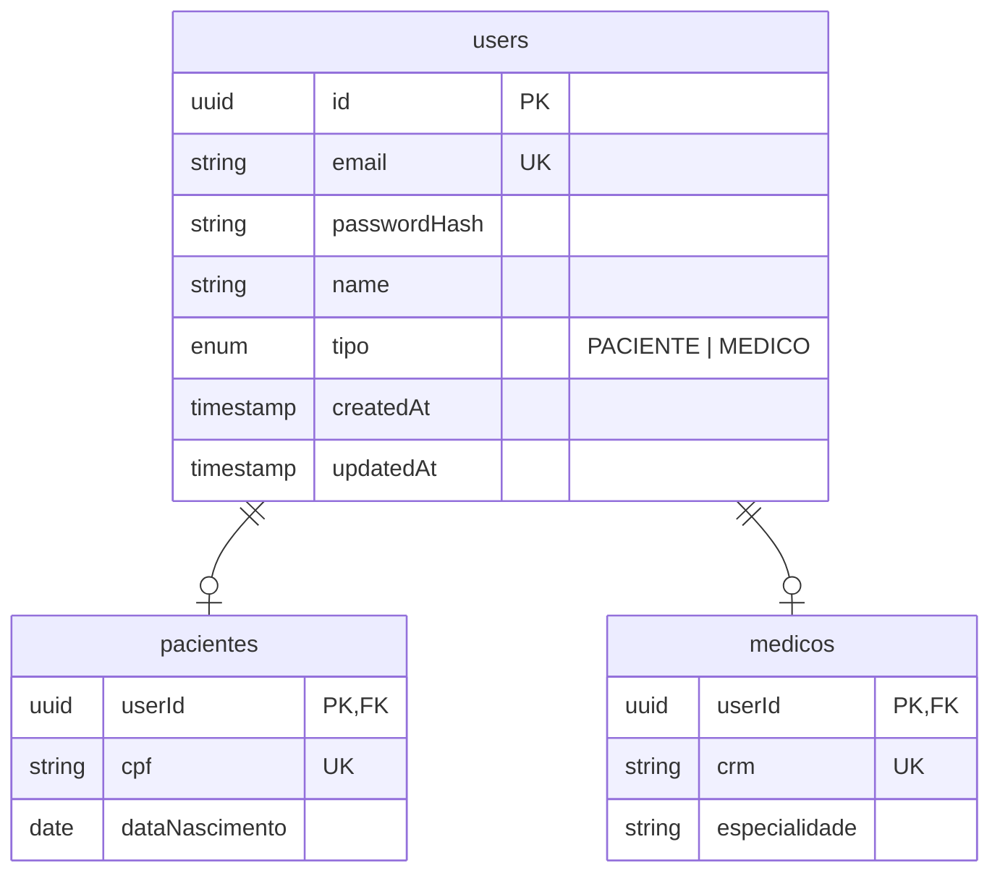

# Modelagem de Usuários

## Abordagem Escolhida: Tabela base + tabelas filhas (1:1)

Todos os usuários compartilham uma tabela central `users` para autenticação e dados comuns. Cada usuário possui uma relação 1:1 com a tabela específica do seu perfil (`pacientes` ou `medicos`).

### Justificativas

- **Unicidade de e-mail garantida pelo banco:** a constraint `UNIQUE` em `users.email` impede nativamente colisões entre médicos e pacientes.
- **Login simples:** o endpoint `/users/login` consulta apenas `users` para validar credenciais e identificar o tipo de perfil via coluna `tipo`.
- **JWT centralizado:** um único UUID por usuário facilita autorização via Guards no NestJS.
- **Sem duplicação de lógica:** autenticação, hash de senha e geração de token ficam em um único serviço.

---

## Estrutura de Atributos

### `users` (tabela base)

| Coluna         | Tipo      | Restrição   |
|----------------|-----------|-------------|
| `id`           | UUID      | PK          |
| `email`        | String    | UNIQUE      |
| `passwordHash` | String    |             |
| `name`         | String    |             |
| `tipo`         | Enum      | PACIENTE \| MEDICO |
| `createdAt`    | Timestamp | auto        |
| `updatedAt`    | Timestamp | auto        |

### `pacientes` (tabela filha)

| Coluna           | Tipo   | Restrição       |
|------------------|--------|-----------------|
| `userId`         | UUID   | PK + FK → users |
| `cpf`            | String | UNIQUE          |
| `dataNascimento` | Date   |                 |

### `medicos` (tabela filha)

| Coluna        | Tipo   | Restrição       |
|---------------|--------|-----------------|
| `userId`      | UUID   | PK + FK → users |
| `crm`         | String | UNIQUE          |
| `especialidade` | String |               |

---

## Diagrama Entidade-Relacionamento

