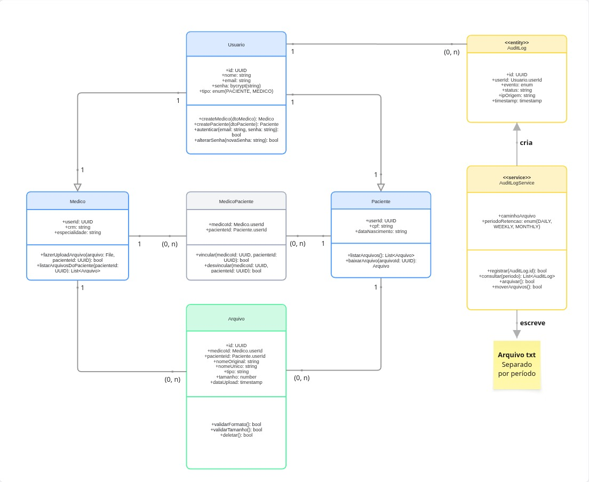

# Diagrama de Classes

## Visão Geral

O diagrama de classes representa a estrutura do sistema HealthTech, organizando entidades de domínio, tabelas associativas e serviços. O modelo cobre autenticação, gerenciamento de arquivos médicos e auditoria, com estratégia híbrida de armazenamento para logs.

[Visualização da Imagem](../assets/diagramas/diagrama_classe.jpg)

---

## Entidades

### Usuario

Classe base que centraliza autenticação e dados comuns a todos os usuários da plataforma.

**Atributos:**

- `id: UUID`: identificador único
- `nome: string`: nome completo
- `email: string`: email único de autenticação
- `senha: bycrypt(string)`: senha armazenada como hash bcrypt
- `tipo: enum(PACIENTE, MEDICO)`: diferencia o perfil do usuário

**Métodos:**

- `createMedico(dtoMedico): Medico`: cria perfil de médico vinculado
- `createPaciente(dtoPaciente): Paciente`: cria perfil de paciente vinculado
- `autenticar(email: string, senha: string): bool`: valida credenciais
- `alterarSenha(novaSenha: string): bool`: atualiza senha com novo hash

---

### Paciente

Especialização de Usuario que representa pacientes da plataforma. Herda atributos de autenticação e adiciona dados específicos.

**Atributos:**

- `userId: UUID`: FK para Usuario
- `cpf: string`: CPF único do paciente
- `dataNascimento: string`: data de nascimento

**Métodos:**

- `listarArquivos(): List<Arquivo>`: retorna arquivos vinculados ao paciente
- `baixarArquivo(arquivoId: UUID): Arquivo`: realiza download de arquivo autorizado

---

### Medico

Especialização de Usuario que representa médicos da plataforma. Herda atributos de autenticação e adiciona dados profissionais.

**Atributos:**

- `userId: UUID`: FK para Usuario
- `crm: string`: registro profissional único
- `especialidade: string`: área de atuação

**Métodos:**

- `fazerUploadArquivo(arquivo: File, pacienteId: UUID): bool`: envia novo arquivo vinculado a um paciente
- `listarArquivosDoPaciente(pacienteId: UUID): List<Arquivo>`: lista arquivos de um paciente vinculado

---

### MedicoPaciente (tabela associativa)

Resolve o relacionamento N: N entre médicos e pacientes. Um médico pode atender vários pacientes e um paciente pode ser atendido por vários médicos.

**Atributos:**

- `medicoId: Medico.userId`: FK composta
- `pacienteId: Paciente.userId`: FK composta

**Métodos:**

- `vincular(medicoId: UUID, pacienteId: UUID): bool`: cria vínculo
- `desvincular(medicoId: UUID, pacienteId: UUID): bool`: remove vínculo

---

### Arquivo

Representa metadados de exames e documentos médicos. O binário real é armazenado no Google Cloud Storage; esta entidade guarda apenas referências e metadados.

**Atributos:**

- `id: UUID`: identificador único
- `medicoId: Medico.userId`: FK para o médico que fez o upload
- `pacienteId: Paciente.userId`: FK para o paciente vinculado
- `nomeOriginal: string`: nome do arquivo enviado pelo usuário
- `nomeUnico: string`: nome interno utilizado no storage
- `tipo: string`: extensão (pdf, jpg, jpeg, png)
- `tamanho: number`: tamanho do arquivo em bytes
- `dataUpload: timestamp`: momento do upload

**Métodos:**

- `validarFormato(): bool`: verifica se o tipo do arquivo é permitido
- `validarTamanho(): bool`: verifica se o tamanho está dentro do limite
- `deletar(): bool`: remove o arquivo do storage e os metadados do banco

---

## Auditoria: Estratégia Híbrida

A auditoria utiliza dois níveis de armazenamento para combinar desempenho e economia de recursos.

### AuditLog (entity)

Tabela de logs no banco que armazena eventos recentes. Permite consulta rápida via SQL para o período ativo.

**Atributos:**

- `id: UUID`: identificador único do log
- `userId: Usuario.userId`: FK para o usuário que gerou o evento
- `evento: enum`: tipo do evento (LOGIN_SUCCESS, UPLOAD_SUCCESS, ACCESS_DENIED, etc.)
- `status: string`: resultado do evento
- `ipOrigem: string`: endereço IP da requisição
- `timestamp: timestamp`: momento exato do evento

### AuditLogService (service)

Serviço responsável por toda a lógica de auditoria. Não é uma tabela do banco, mas uma classe de comportamento que orquestra escrita, leitura e arquivamento de logs.

**Atributos:**

- `caminhoArquivo: string`: diretório onde os arquivos `.txt` arquivados são salvos
- `periodoRetencao: enum(DAILY, WEEKLY, MONTHLY)`: frequência da rotação de arquivos

**Métodos:**

- `registrar(AuditLog.id): bool`: insere novo log na tabela
- `consultar(periodo): List<AuditLog>`: consulta logs (banco para recentes, arquivo para antigos)
- `arquivar(): bool`: exporta logs antigos do banco para arquivo `.txt`
- `moverArquivos(): bool`: limpa logs já arquivados da tabela

### Fluxo da estratégia híbrida

1. Cada evento do sistema invoca `AuditLogService.registrar()`.
2. O service insere o registro na tabela `AuditLog` (hot storage).
3. Periodicamente, um job agendado chama `arquivar()`.
4. Logs antigos são exportados para arquivo `.txt` separado por período (cold storage).
5. Após o arquivamento, `moverArquivos()` remove da tabela os logs já persistidos em arquivo.
6. Consultas para períodos recentes leem do banco; consultas para períodos antigos leem do arquivo.

---

## Relacionamentos e Cardinalidades

| Origem          | Destino        | Cardinalidade | Tipo        | Descrição                                             |
| --------------- | -------------- | ------------- | ----------- | ----------------------------------------------------- |
| Usuario         | Paciente       | 1: 1          | Herança     | Paciente é especialização de Usuario                  |
| Usuario         | Medico         | 1: 1          | Herança     | Medico é especialização de Usuario                    |
| Medico          | MedicoPaciente | 1: (0, N)     | Associação  | Um médico possui vários vínculos                      |
| Paciente        | MedicoPaciente | 1: (0, N)     | Associação  | Um paciente possui vários vínculos                    |
| Medico          | Arquivo        | 1: (0, N)     | Associação  | Um médico faz upload de vários arquivos               |
| Paciente        | Arquivo        | 1: (0, N)     | Associação  | Um paciente possui vários arquivos vinculados         |
| Usuario         | AuditLog       | 1: (0, N)     | Associação  | Um usuário gera vários eventos de log                 |
| AuditLogService | AuditLog       | :             | Dependência | Service cria e consulta registros de AuditLog         |
| AuditLogService | Arquivo txt    | :             | Dependência | Service escreve logs antigos em arquivos rotacionados |

### Resolução do N: N

O relacionamento N: N entre Medico e Paciente é resolvido pela tabela associativa `MedicoPaciente`. Cada par (medicoId, pacienteId) representa um vínculo único na plataforma.

---

## Convenções Visuais

| Grupo                                            | Cor           | Estereótipo                  |
| ------------------------------------------------ | ------------- | ---------------------------- |
| Entidades de usuário (Usuario, Paciente, Medico) | Azul claro    | (entity implícito)           |
| Tabela associativa (MedicoPaciente)              | Cinza         | (associative)                |
| Entidade de domínio (Arquivo)                    | Verde         | (entity implícito)           |
| Auditoria (AuditLog, AuditLogService)            | Amarelo       | `<<entity>>` e `<<service>>` |
| Nota explicativa (Arquivo txt)                   | Amarelo claro | (sticky note)                |

**Tipos de conexão:**

- Linha sólida com cardinalidade: associação entre entidades
- Linha sólida com triângulo vazado: herança (Usuario → Paciente, Usuario → Medico)
- Linha sólida com seta: dependência funcional do service (cria, escreve)

---

## Considerações Técnicas

### Sobre o tipo File no upload

O parâmetro `arquivo: File` no método `fazerUploadArquivo` representa o binário recebido na requisição multipart/form-data. Não é uma entidade persistida, apenas um tipo nativo do framework que será processado pelo backend e transformado em metadados na entidade `Arquivo`. O conteúdo binário em si vai para o Google Cloud Storage.

### Sobre armazenamento de logs em produção

Em ambiente de produção (Cloud Run), `caminhoArquivo` deve apontar para um bucket no Google Cloud Storage, já que o Cloud Run não possui disco persistente. Em desenvolvimento local, pode apontar para um diretório no projeto.

### Sobre o formato dos arquivos de log

Recomenda-se utilizar JSON Lines (`.jsonl`) em vez de texto puro, pois cada linha se torna um objeto JSON parseável independente, facilitando consultas e processamento automatizado.
