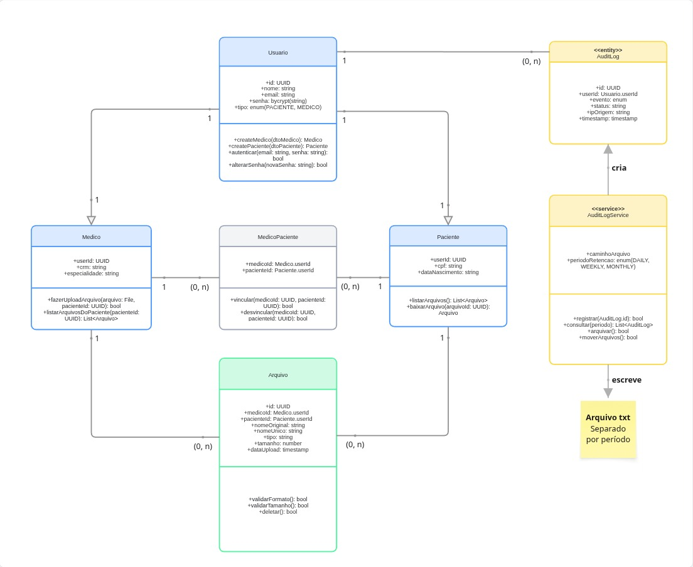

# Diagrama de Classes

## Visão Geral

O diagrama de classes representa a estrutura do sistema HealthTech, organizando entidades de domínio, tabelas associativas e serviços. O modelo cobre autenticação, gerenciamento de arquivos, especialidades, vínculo médico-paciente com workflow de aprovação e auditoria.

[Visualização da Imagem](../assets/diagramas/diagrama_classe.jpg)

---

## Entidades

### Usuario (`users`)

Classe base que centraliza autenticação e dados comuns a todos os usuários da plataforma.

**Atributos**

- `id: UUID`: identificador único
- `nome: string`: nome completo
- `email: string`: email único de autenticação
- `passwordHash: string`: hash bcrypt (10 rounds)
- `tipo: enum(PACIENTE, MEDICO, ADMIN)`: perfil operacional
- `createdAt, updatedAt: timestamp`

**Métodos (serviço)**

- `createMedico(dto)`: cria perfil de médico e vincula às especialidades escolhidas
- `createPaciente(dto)`: cria perfil de paciente
- `login(dto)`: valida credenciais e retorna `{ accessToken, user }`
- `me(req)`: retorna dados do usuário autenticado

---

### Paciente (`pacientes`)

Especialização de `Usuario`. Herda `id` e adiciona dados do paciente.

**Atributos**

- `userId: UUID`: FK para `Usuario`
- `cpf: string`: único
- `dataNascimento: date`

**Interações**

- Consulta arquivos ligados a si (`GET /arquivos`).
- Aprova, rejeita ou revoga vínculos com médicos.

---

### Medico (`medicos`)

Especialização de `Usuario`. Adiciona `crm` e a relação N:N com `Especialidade`.

**Atributos**

- `userId: UUID`: FK para `Usuario`
- `crm: string`: único
- `especialidade_legado: string?`: coluna legada mantida por um release para permitir rollback

**Interações**

- Solicita vínculos (`POST /medico-paciente/vincular`).
- Faz upload, edita e exclui arquivos.
- Consulta o prontuário de pacientes vinculados.

---

### Especialidade (`especialidades`)

**Atributos**

- `id: UUID`
- `nome: string`
- `slug: string`: único
- `ativa: boolean`

Relação N:N com `Medico` via tabela `medico_especialidades`.

---

### MedicoPaciente (`medico_paciente`)

Tabela associativa com workflow de consentimento (LGPD art. 8).

**Atributos**

- `medicoId: UUID` (PK + FK)
- `pacienteId: UUID` (PK + FK)
- `status: enum(PENDENTE, APROVADO, REJEITADO, REVOGADO)`
- `solicitadoPor: UUID`
- `solicitadoEm: timestamp`
- `respondidoEm: timestamp?`
- `termoVersao: string?`: versão do termo aceito na aprovação
- `vinculadoEm: timestamp`

**Métodos (serviço)**

- `solicitarVinculo(medicoId, pacienteId)`
- `aprovarSolicitacao(pacienteId, medicoId)`
- `rejeitarSolicitacao(pacienteId, medicoId)`
- `revogarAcesso(pacienteId, medicoId)`
- `desvincular(medicoId, pacienteId)`

---

### Arquivo (`arquivos`)

Metadados de exames e documentos médicos. O binário fica no storage.

**Atributos**

- `id: UUID`
- `nomeOriginal: string`
- `nomeUnico: string`
- `tipo: string`: MIME (`application/pdf`, `image/jpeg`, `image/png`)
- `tamanho: number`
- `descricao: string?`
- `caminhoStorage: string`: campo sensível, jamais serializado na API
- `dataUpload: timestamp`
- `pacienteId, medicoUploadId: UUID`

**Métodos (serviço)**

- `uploadArquivo(file, pacienteId, medicoId, descricao?)`
- `listarParaMedico(medicoId)`, `listarParaPaciente(pacienteId)`
- `listarProntuarioPaciente(medicoId, pacienteId)`
- `gerarUrlDownload(id, userId, tipo)`
- `obterConteudoParaStream(id, userId, tipo)`
- `atualizarDescricao(id, medicoId, dto)`
- `excluirArquivo(id, medicoId)`

---

## Auditoria

### AuditLog (`audit_logs`)

**Atributos**

- `id: UUID`
- `userId: UUID?`: pode ser nulo em tentativas de login inválidas
- `tipoEvento: enum(TipoEventoAuditoria)`
- `recursoId: UUID?`
- `status: enum(SUCCESS, FAILURE)`
- `ipOrigem: string`
- `userAgent: string?`
- `timestamp: timestamp`

### TipoEventoAuditoria

`LOGIN`, `LOGOUT`, `CRIACAO_USUARIO`, `ATUALIZACAO_USUARIO`, `EXCLUSAO_USUARIO`, `UPLOAD_ARQUIVO`, `DOWNLOAD_ARQUIVO`, `VISUALIZACAO_ARQUIVO`, `EXCLUSAO_ARQUIVO`, `VINCULO_MEDICO_PACIENTE`, `DESVINCULO_MEDICO_PACIENTE`, `SOLICITACAO_VINCULO`, `APROVACAO_VINCULO`, `REJEICAO_VINCULO`, `REVOGACAO_VINCULO`, `ACESSO_NEGADO`, `TENTATIVA_ESCALONAMENTO_PRIVILEGIO`.

> `LOGIN_FALHA` foi removido do enum (issue #57): a consulta equivalente passa a ser `WHERE tipoEvento = 'LOGIN' AND status = 'FAILURE'`.

### AuditInterceptor + @Audit

Interceptor global registrado em `AppModule`. Lê a metadata do decorator `@Audit({...})` no handler, registra `SUCCESS` no `tap` e `FAILURE` no `catchError`, sempre re-lançando a exceção original. Detalhes em [Arquitetura do Backend](../arquitetura/backend.md).

---

## Relacionamentos e Cardinalidades

| Origem     | Destino          | Cardinalidade | Descrição                                             |
| ---------- | ---------------- | ------------- | ----------------------------------------------------- |
| Usuario    | Paciente         | 1:1           | Paciente é especialização de Usuario                  |
| Usuario    | Medico           | 1:1           | Medico é especialização de Usuario                    |
| Medico     | Especialidade    | N:N           | Via `medico_especialidades`                           |
| Medico     | MedicoPaciente   | 1:N           | Um médico possui várias solicitações e vínculos       |
| Paciente   | MedicoPaciente   | 1:N           | Um paciente possui vários vínculos                    |
| Medico     | Arquivo          | 1:N           | Um médico envia vários arquivos (`medicoUploadId`)    |
| Paciente   | Arquivo          | 1:N           | Um paciente possui vários arquivos                    |
| Usuario    | AuditLog         | 1:N           | Um usuário gera vários eventos de auditoria           |

O relacionamento N:N entre Medico e Paciente é resolvido pela tabela associativa `medico_paciente`. Cada par (`medicoId`, `pacienteId`) representa um vínculo único, com histórico de status.

---

## Considerações Técnicas

### Sobre o tipo `File` no upload

O parâmetro `arquivo: Express.Multer.File` no `POST /arquivos/upload` representa o binário recebido em multipart/form-data. Não é uma entidade persistida: só o metadado (`Arquivo`) e o binário no storage.

### Sobre armazenamento em produção

Em produção o `StorageService` usa o driver `gcs` (Google Cloud Storage). Em desenvolvimento usa o driver `local`, gravando em `LOCAL_STORAGE_DIR` (`uploads` por padrão).

### Sobre a coluna `especialidade_legado`

A coluna existe apenas para permitir rollback do deploy que introduziu `especialidades`/`medico_especialidades`. Será removida em migration posterior.
