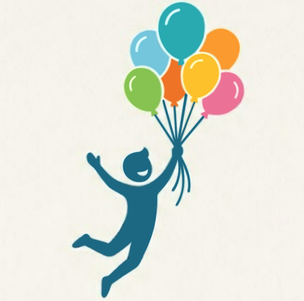
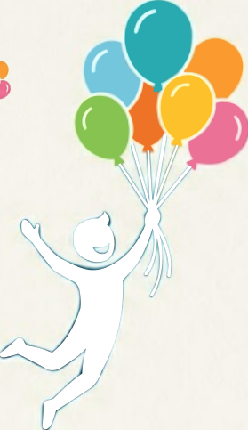
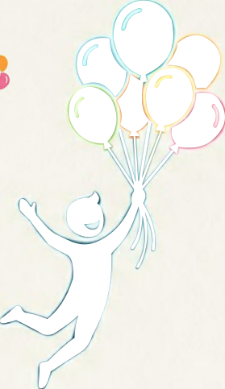
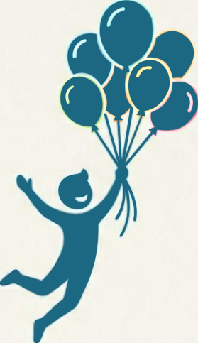
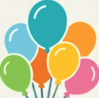

# Identidade Visual - HealthTech

## 1. Visão Geral do Projeto

- Propósito do site: **\_\_**
- Público-alvo: **Médicos e pacientes**
- Estilo desejado: **\_\_**
- Tom de voz: **\_\_**

## 2. Logo

- Versões do logo:
  

    <figure style="display:inline-block; margin:0;">
      
      <figcaption style="text-align:center; font-size:0.9rem;">Principal</figcaption>
    </figure>
  

  

    <figure style="display:inline-block; text-align:center; margin:0;">
      
      <figcaption style="font-size:0.85rem;">Versão branco</figcaption>
    </figure>
    <figure style="display:inline-block; text-align:center; margin:0;">
      
      <figcaption style="font-size:0.85rem;">Versão todo branco</figcaption>
    </figure>
    <figure style="display:inline-block; text-align:center; margin:0;">
      
      <figcaption style="font-size:0.85rem;">Versão ciano</figcaption>
    </figure>
    <figure style="display:inline-block; margin:0;">
      
      <figcaption style="text-align:center; font-size:0.9rem;">Ícone (balões)</figcaption>
    </figure>

- Descrição do logo: **Uma pessoa feliz segurando balões que o fazem voar.**
- Conceito e significado: 
    - A Silhueta Humana: Representa o indivíduo em movimento e celebração. A postura de voo transmite vitalidade, energia e autonomia. A cor azul traz uma base de confiança e segurança, essenciais para o setor de saúde.
    - Os Balões: Simbolizam o fator de elevação. Na metáfora da marca, eles são a saúde e a tecnologia que "levantam" a pessoa, permitindo que ela escape de limitações.
    - As Cores Vibrantes: Os tons coloridos (verde, azul, amarelo, laranja e rosa) mostram que a saúde é multifacetada e que o resultado de se cuidar é uma vida alegre, leve e cheia de cor.
    - A saúde não é apenas a ausência de doença, mas o combustível que nos dá a liberdade para voar alto e viver sem barreiras.

- Usos recomendados: **__**
- Espaçamento mínimo ao redor do logo: **__**

## 3. Imagens

- Estilo visual das imagens: **\_\_**
- Tipos de imagens a utilizar (fotos, ilustrações, ícones): **\_\_**
- Tratamento de imagens (filtros, saturação, contraste): **\_\_**
- Exemplo de imagens permitidas: **\_\_**
- Imagens a evitar: **\_\_**

## 4. Cores

| Categoria | Cor / Hex | Preview | Função Principal |
| --- | --- | --- | --- |
| Principal | #1e4969 |  | Logos, cabeçalhos, botões institucionais e autoridade. |
| Secundária | #368ca0 |  | Elementos tech, links, sublinhados e destaques frios. |
| Fundo Principal | #FFFFFF |  | Áreas de leitura e fundo geral. |
| Fundo Alternativo | #F4F7F9 (Sugerido) |  | Fundo de seções, cards e separadores. |
| Texto Escuro | #1A1A1A |  | Títulos e textos longos (alta legibilidade). |
| Texto Claro | #595959 |  | Legendas, placeholders e textos de apoio. |
| Sucesso | #70C1A3 |  | Botões de sucesso, mensagens de confirmação e estados positivos. |
| Alerta | #f2b138 |  | Avisos moderados, banners de atenção e alertas informativos. |
| Erro | #e14c4c |  | Erros, mensagens de falha e estados críticos. |

## 5. Tipografia

- Fonte principal (títulos): **Inter** (Pesos: 700 Bold / 600 Semi-Bold)
- Fonte secundária (corpo de texto): **Inter** (Peso: 400 Regular) — Garante melhor legibilidade em telas.
- Fonte alternativa (botões/legendas): **Inter** (Peso: 500 Medium / 600 Semi-Bold)

## 6. Tamanhos e Espaçamentos

- Tamanho dos títulos:
  - H1: **3rem (48px)**
  - H2: **2.25rem (36px)**
  - H3: **1.75rem (28px)**
- Tamanho do corpo de texto: **1rem (16px)**
- Altura de linha padrão: **1.5**
- Espaçamento entre seções: **3rem**
- Margens e padding principais: **1.5rem**
- Tamanho de botões: **1rem a 1.125rem (16-18px)**
- Tamanho de ícones: **24px a 32px**

## 7. Aplicações no Site

## 8. Observações Finais

- Regras de uso da identidade visual: **\_\_**
- Elementos a evitar: **\_\_**
- Referências de inspiração: **\_\_**
