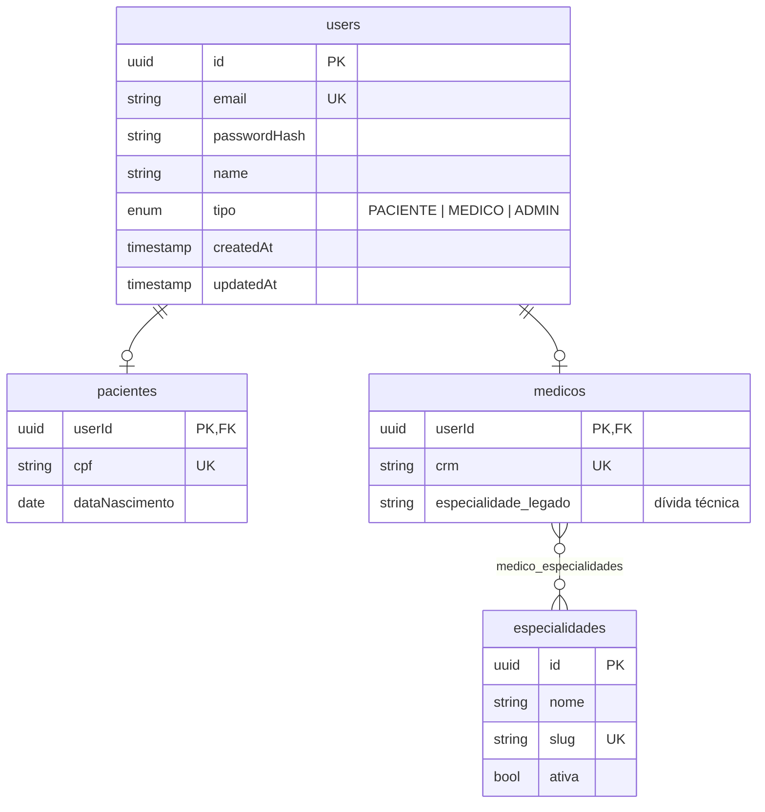

# Modelagem de Usuários

## Abordagem Escolhida: tabela base + tabelas filhas (1:1)

Todos os usuários compartilham a tabela central `users` para autenticação e dados comuns. Cada perfil de negócio (paciente ou médico) possui uma relação 1:1 com a tabela específica. `ADMIN` não tem tabela filha porque não é um papel de negócio: é um perfil operacional criado apenas via seed.

### Justificativas

- **Unicidade de e-mail garantida pelo banco**: a constraint `UNIQUE` em `users.email` impede colisões entre médicos, pacientes e administradores.
- **Login simples**: o endpoint `/users/login` consulta apenas `users` para validar credenciais e identificar o perfil pela coluna `tipo`.
- **JWT centralizado**: um único UUID por usuário facilita autorização via Guards no NestJS. O payload já inclui `tipo`, evitando consultas extras em cada requisição.
- **Sem duplicação de lógica**: autenticação, hash de senha e geração de token ficam em um único serviço.

---

## Estrutura de Atributos

### `users` (tabela base)

| Coluna         | Tipo      | Restrição                                 |
| -------------- | --------- | ----------------------------------------- |
| `id`           | UUID      | PK                                        |
| `email`        | VARCHAR   | UNIQUE                                    |
| `passwordHash` | VARCHAR   | NOT NULL                                  |
| `name`         | VARCHAR   | NOT NULL                                  |
| `tipo`         | ENUM      | `PACIENTE`, `MEDICO` ou `ADMIN`           |
| `createdAt`    | TIMESTAMP | auto                                      |
| `updatedAt`    | TIMESTAMP | auto                                      |

### `pacientes` (tabela filha)

| Coluna           | Tipo | Restrição       |
| ---------------- | ---- | --------------- |
| `userId`         | UUID | PK + FK → users |
| `cpf`            | VARCHAR | UNIQUE       |
| `dataNascimento` | DATE | NOT NULL        |

### `medicos` (tabela filha)

| Coluna                 | Tipo    | Restrição       |
| ---------------------- | ------- | --------------- |
| `userId`               | UUID    | PK + FK → users |
| `crm`                  | VARCHAR | UNIQUE          |
| `especialidade_legado` | VARCHAR | NULL (dívida técnica, será removida em migration posterior) |

A relação N:N do médico com especialidades é modelada nas tabelas `especialidades` e `medico_especialidades`. Veja [Banco de Dados](../arquitetura/banco-de-dados.md).

### Provisionamento do `ADMIN`

O `ADMIN` só pode ser criado por meio do seed manual `npm run seed:admin`, que exige `ADMIN_EMAIL` e `ADMIN_PASSWORD` no ambiente. As rotas públicas de cadastro (`POST /users/pacientes`, `POST /users/medicos`) rejeitam qualquer campo `tipo` extra (`forbidNonWhitelisted: true`).

---

## Diagrama Entidade-Relacionamento

