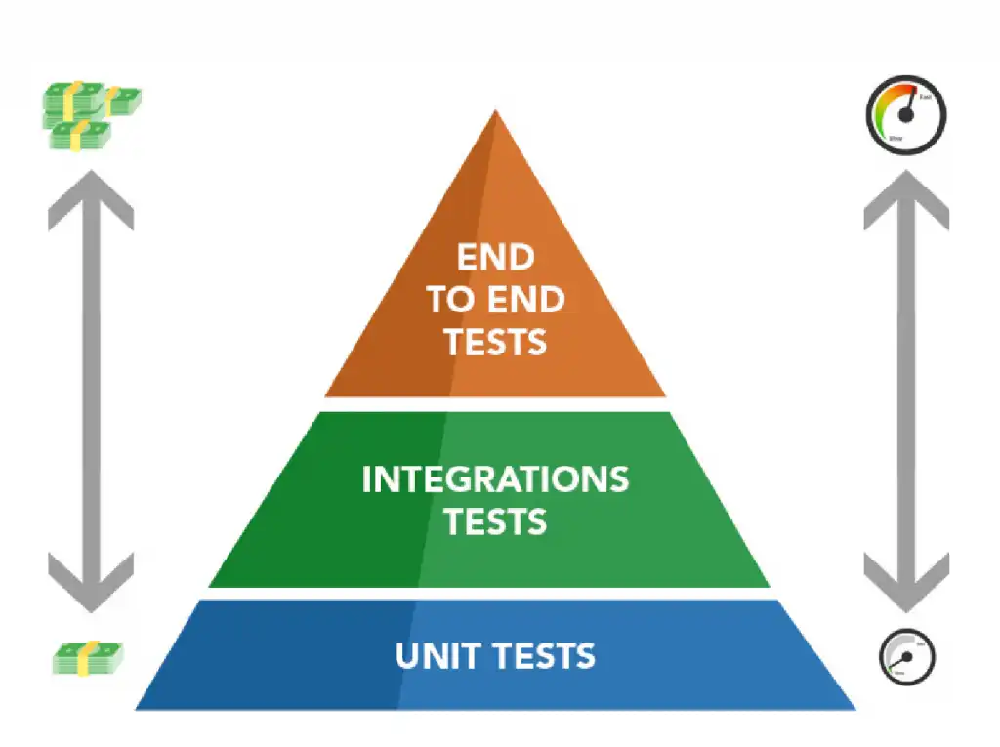

# Testes Automatizados

Testes são parte do critério de "Definição de Pronto" do projeto. Funcionalidades críticas (cadastro, login, rotas protegidas) precisam de testes automatizados antes do merge.

## Pirâmide de Testes

Iremos utilizar como principio de testes essa pirâmide:



> Figura 1: Pirâmide de Testes

- **Unitários**: testam uma função/service isolado, com mocks nas dependências. Rodam em milissegundos.
- **Integração**: testam módulos trabalhando juntos (ex: Controller + Service + Repository com banco em memória).
- **E2E (End-to-End)**: testam o sistema completo (HTTP real, banco real, fluxo do usuário).

---

## Testes de Backend (NestJS)

O NestJS por padrão já garante os arquivos e padrões de testes.

### Jest

**O que é:**
Jest é o framework de testes JavaScript/TypeScript mais usado no ecossistema Node. É o test runner padrão tanto do NestJS quanto do Next.js. Inclui assertions (`expect`), mocks e cobertura de código numa única ferramenta.

**Como funciona no projeto:**
Arquivos `*.spec.ts` ao lado do código testado são detectados automaticamente. Cada `describe` agrupa testes; cada `it`/`test` é um caso.

```typescript
// users.service.spec.ts
describe("UsersService", () => {
  it("deve gerar hash da senha antes de salvar", async () => {
    const result = await service.create({ email: "a@a.com", password: "123" });
    expect(result.passwordHash).not.toBe("123");
  });
});
```

**Comandos:**

```bash
npm run test           # Roda testes unitários
npm run test:watch     # Modo watch
npm run test:cov       # Com relatório de cobertura
npm run test:e2e       # Roda testes end-to-end
```

---

### @nestjs/testing

**O que é:**
Pacote oficial do NestJS para criar contextos de teste isolados. Fornece o `Test.createTestingModule()`, que monta uma versão mínima da aplicação apenas com os providers necessários, permitindo substituir dependências por mocks.

**Como funciona:**

```typescript
const module: TestingModule = await Test.createTestingModule({
  providers: [
    UsersService,
    {
      provide: getRepositoryToken(User),
      useValue: { save: jest.fn(), findOne: jest.fn() }, // mock do banco
    },
  ],
}).compile();

const service = module.get<UsersService>(UsersService);
```

**Por que foi escolhido:**

- Permite testar services sem subir o banco real
- Isola dependências, garantindo que o teste falhe pelo motivo certo
- Integração nativa com TypeORM, JWT e outros módulos NestJS

---

### Supertest

**O que é:**
Supertest é uma biblioteca para testar APIs HTTP. Ele sobe a aplicação NestJS em memória e dispara requisições reais (`GET`, `POST`, etc.) contra ela, validando status e body da resposta.

**Como funciona no projeto:**

```typescript
// test/users.e2e-spec.ts
it("POST /api/users/register cria um usuário", () => {
  return request(app.getHttpServer())
    .post("/api/users/register")
    .send({ name: "Teste", email: "teste@x.com", password: "senha123" })
    .expect(201)
    .expect((res) => {
      expect(res.body.passwordHash).toBeUndefined(); // hash não deve retornar
    });
});
```

**Por que foi escolhido:**

- Test E2E sem precisar subir o servidor numa porta real
- Confirma que `ValidationPipe`, guards e interceptors estão ativos no fluxo
- Documentação acessível e exemplos diretos no boilerplate do NestJS

---

## Frontend - Next.js + React

### Jest

Já descrito acima - o mesmo runner é usado no frontend, configurado pelo Next.js para entender JSX/TSX.

### React Testing Library (RTL)

**O que é:**
Biblioteca para testar componentes React do ponto de vista do **usuário final**, não da implementação interna. Em vez de buscar componentes por classe ou ID, busca por texto visível, label ou role de acessibilidade (igual um usuário faria).

**Como funciona no projeto:**

```tsx
// register/page.test.tsx
import { render, screen } from "@testing-library/react";
import userEvent from "@testing-library/user-event";

it("exibe erro quando senha tem menos de 6 caracteres", async () => {
  render(<RegisterPage />);

  await userEvent.type(screen.getByLabelText(/senha/i), "123");
  await userEvent.click(screen.getByRole("button", { name: /cadastrar/i }));

  expect(screen.getByText(/mínimo 6 caracteres/i)).toBeInTheDocument();
});
```

**Por que foi escolhido:**

- Padrão de fato para testes de componente em React
- Filosofia "teste o que o usuário vê" reduz testes frágeis que quebram em refatorações
- Recomendado oficialmente pela equipe do React

---

### @testing-library/user-event

**O que é:**
Complemento da RTL que simula interações do usuário (digitar, clicar, focar) de forma mais realista do que `fireEvent`. Por exemplo, `userEvent.type()` simula o evento `keydown`, `keypress` e `keyup` para cada tecla - exatamente como um teclado real.

**Por que foi escolhido:**

- Mais fiel ao comportamento real do navegador
- Detecta bugs que `fireEvent` mascara (ex: handlers que só rodam em `keyup`)

---

### Playwright (E2E recomendado)

**O que é:**
Playwright é uma ferramenta de testes E2E criada pela Microsoft que controla um navegador real (Chromium, Firefox, WebKit). Permite testar o sistema completo: usuário abre a página, preenche o formulário, vê o resultado.

**Como funcionará no projeto:**

```typescript
// e2e/register.spec.ts
test("usuário consegue se cadastrar", async ({ page }) => {
  await page.goto("http://localhost:3000/register");
  await page.fill('input[name="email"]', "novo@user.com");
  await page.fill('input[name="password"]', "senha123");
  await page.click('button:has-text("Cadastrar")');
  await expect(page.getByText(/cadastrado com sucesso/i)).toBeVisible();
});
```

**Por que foi escolhido:**

- Suporte a múltiplos navegadores num único teste
- Auto-wait inteligente (evita `sleep` arbitrário)
- Geração automática de testes via `npx playwright codegen`
- Alternativa: **Cypress** (mais simples para iniciantes, mas só roda em Chromium)

---

## Cobertura mínima esperada

Definida no documento de [Padrões de Código](../../padroes/codigo.md):

| Camada           | Tipo de teste obrigatório                 |
| ---------------- | ----------------------------------------- |
| `users.service`  | Unitário (hash de senha, email duplicado) |
| `auth.service`   | Unitário + E2E (login válido/inválido)    |
| Rotas protegidas | E2E (acesso negado sem token)             |
| Formulário front | Componente (validação, estados de erro)   |

> **Regra:** correção de bug deve vir acompanhada de teste de regressão, quando aplicável.

---

## Referências

- [Jest - Documentação oficial](https://jestjs.io/docs/getting-started)
- [Jest - Matchers (`expect`)](https://jestjs.io/docs/expect)
- [NestJS - Testing](https://docs.nestjs.com/fundamentals/testing)
- [NestJS - Testing Database](https://docs.nestjs.com/recipes/sql-typeorm#testing)
- [Supertest - Repositório](https://github.com/ladjs/supertest)
- [React Testing Library - Documentação](https://testing-library.com/docs/react-testing-library/intro/)
- [React Testing Library - Cheatsheet](https://testing-library.com/docs/react-testing-library/cheatsheet)
- [Testing Library - user-event](https://testing-library.com/docs/user-event/intro)
- [Playwright - Documentação oficial](https://playwright.dev/docs/intro)
- [Playwright - Test Generator (codegen)](https://playwright.dev/docs/codegen)
- [Roadmap.sh - QA Roadmap](https://roadmap.sh/qa)
- [Kent C. Dodds - Testing Trophy](https://kentcdodds.com/blog/the-testing-trophy-and-testing-classifications)
