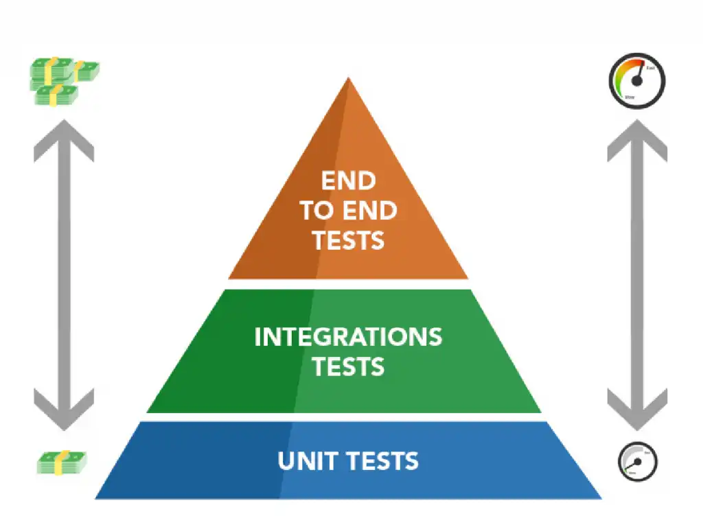

# Testes Automatizados

Testes são parte do critério de "Definição de Pronto" do projeto. Funcionalidades críticas (cadastro, login, rotas protegidas, upload, vínculo) precisam de testes automatizados antes do merge. Bug fix vem acompanhado de teste de regressão.

## Pirâmide de Testes

Usamos como princípio a pirâmide clássica:



> **Figura 1**: pirâmide de testes.

- **Unitários**: testam uma função ou service isolado, com mocks nas dependências. Rodam em milissegundos.
- **Integração**: testam módulos trabalhando juntos (ex.: Controller + Service + Repository).
- **E2E (End-to-End)**: testam o sistema completo (HTTP real, banco real, fluxo do usuário).

---

## Testes de Backend (NestJS)

### Jest

Framework de testes JavaScript/TypeScript. Runner padrão do NestJS e do Next.js.

```typescript
// users.service.spec.ts
describe("UsersService", () => {
  it("gera hash da senha antes de salvar", async () => {
    const result = await service.createPaciente({ ... });
    expect(result.passwordHash).not.toBe("123");
  });
});
```

Comandos em `backend/`:

```bash
npm run test           # unitários
npm run test:watch     # modo watch
npm run test:cov       # cobertura
npm run test:e2e       # end-to-end (Supertest)
```

### `@nestjs/testing`

Pacote oficial para criar contextos de teste isolados. Substitua dependências reais por mocks via `Test.createTestingModule`:

```typescript
const module: TestingModule = await Test.createTestingModule({
  providers: [
    UsersService,
    {
      provide: getRepositoryToken(User),
      useValue: { save: jest.fn(), findOne: jest.fn() },
    },
  ],
}).compile();
```

### Supertest

Testa APIs HTTP sem subir servidor em porta real. Usado nos `test/*.e2e-spec.ts`:

```typescript
it("POST /users/pacientes cria um paciente", () => {
  return request(app.getHttpServer())
    .post("/users/pacientes")
    .send({ ... })
    .expect(201)
    .expect((res) => {
      expect(res.body.passwordHash).toBeUndefined();
    });
});
```

Confirma que `ValidationPipe`, guards, `AuditInterceptor` e demais peças estão ativas no fluxo.

Especs E2E existentes cobrem: `admin.e2e-spec`, `app.e2e-spec`, `arquivos-crud.e2e-spec`, `arquivos.e2e-spec`, `audit-controller.e2e-spec`, `audit-log.e2e-spec`.

---

## Testes de Frontend

### Jest

Mesmo runner do backend, configurado pelo Next.js para entender JSX/TSX.

### React Testing Library

Foca no comportamento do usuário. Em vez de buscar por classe ou ID, busca por texto visível, label ou role:

```tsx
render(<RegisterPage />);
await userEvent.type(screen.getByLabelText(/senha/i), "123");
await userEvent.click(screen.getByRole("button", { name: /cadastrar/i }));
expect(screen.getByText(/mínimo 6 caracteres/i)).toBeInTheDocument();
```

### `@testing-library/user-event`

Simula interações realistas (eventos completos de teclado, foco, clique). Preferido a `fireEvent`.

Testes existentes cobrem, entre outros: `components/arquivos/__tests__/FilesTable.test.tsx`, `components/especialidades/__tests__/SeletorEspecialidades.test.tsx`, `lib/__tests__/Button.test.jsx`.

---

## Cobertura mínima esperada

| Camada                       | Tipo de teste obrigatório                              |
| ---------------------------- | ------------------------------------------------------ |
| `users.service`              | Unitário (hash de senha, e-mail duplicado)             |
| `auth`                       | Unitário + E2E (login válido, inválido, sem token)     |
| `arquivos.service`           | Unitário + E2E (upload, listagem, download, exclusão)  |
| `audit.controller` + service | Unitário + E2E (filtros, cap de `limit`, `dataFim` inválida) |
| Rotas protegidas             | E2E (acesso negado sem token ou role errada)           |
| Formulários (frontend)       | Componente (validação, estados de erro, sucesso)       |

> Correção de bug deve vir acompanhada de teste de regressão sempre que aplicável.

---

## Referências

- [Jest, documentação](https://jestjs.io/docs/getting-started)
- [NestJS, Testing](https://docs.nestjs.com/fundamentals/testing)
- [Supertest, repositório](https://github.com/ladjs/supertest)
- [React Testing Library](https://testing-library.com/docs/react-testing-library/intro/)
- [`@testing-library/user-event`](https://testing-library.com/docs/user-event/intro)
- [Kent C. Dodds, Testing Trophy](https://kentcdodds.com/blog/the-testing-trophy-and-testing-classifications)
